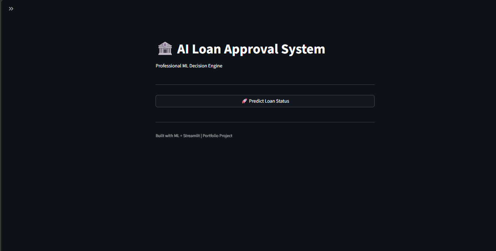
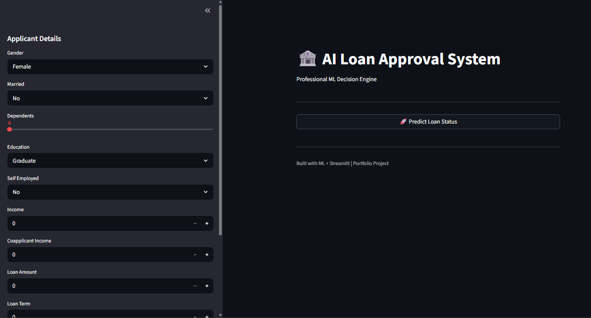
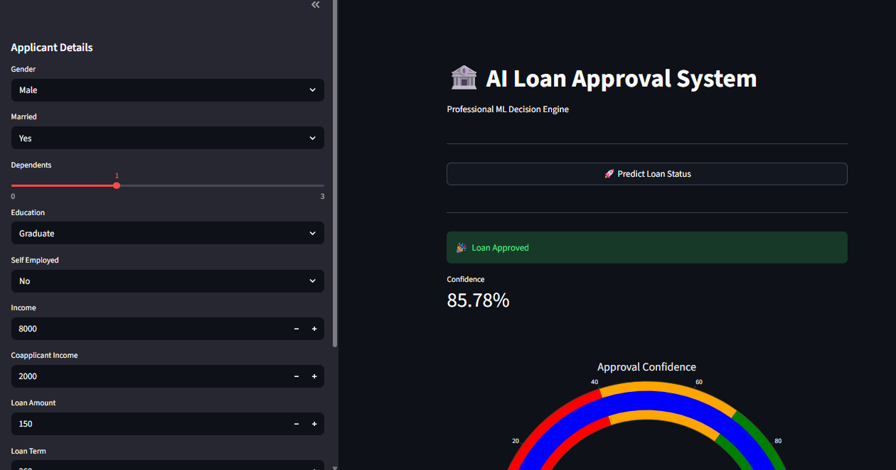
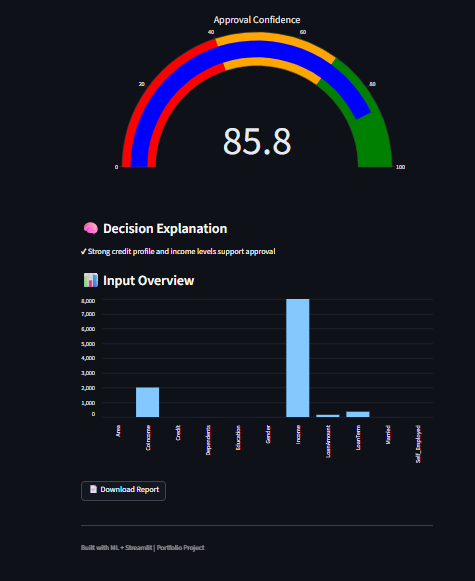
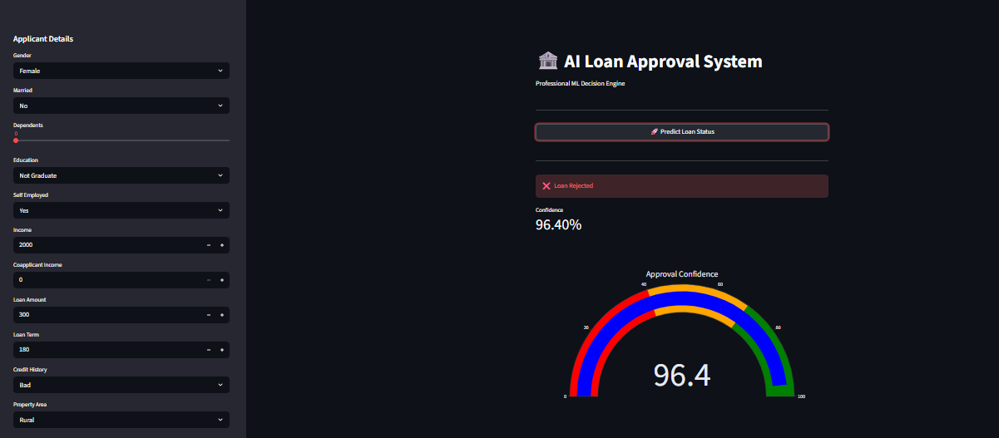
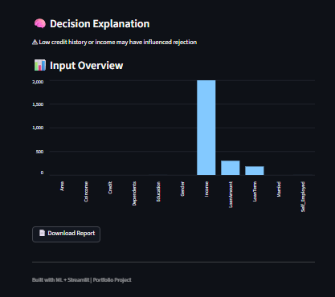

Loan Approval Prediction System (End-to-End Machine Learning Project)

This is a complete machine learning project that predicts whether a loan application will be approved or rejected based on applicant data. The system includes data preprocessing, model training, and a fully interactive Streamlit web application.

---

🚀 Live Application Features
- 🧠 Predict loan approval using Machine Learning
- 📊 Confidence score for each prediction
- 📈 Interactive gauge chart visualization
- 📄 Downloadable PDF report
- 🎛️ Clean Streamlit dashboard interface
- ⚡ Real-time predictions

🛠️ Tech Stack
- Python 🐍  
- Pandas & NumPy  
- Scikit-learn 🤖  
- Streamlit 🌐  
- Plotly 📊  
- Joblib  
- ReportLab 📄  

📂 Project Structure
LOAN-PREDICTION/
│
├── app/
│ └── app.py
│
├── data/
│ └── train.csv
│
├── notebook/
│ └── loan_prediction.ipynb
│
├── screenshots/
│ ├── home1.png
│ ├── home2.png
│ ├── Approved1.png
│ ├── Approved2.png
│ ├── Rejected1.png
│ └── Rejected2.png
│
├── src/
├── loan_model.pkl
├── scaler.pkl
├── requirements.txt
└── README.md

⚙️ How It Works

1. User enters applicant details in the Streamlit app
2. Data is encoded and scaled
3. Machine learning model processes input
4. Output is generated:
   - Loan Approved / Rejected
   - Confidence score
   - Gauge visualization
   - PDF report download option

🧠 Model Details

- Algorithm: Logistic Regression
- Problem Type: Binary Classification
- Target Variable: Loan_Status

Data Processing Steps:
- Missing value handling
- Categorical encoding
- Feature scaling

📸 Screenshots

🏠 Home Screen

View 1

View 2

🎉 Loan Approved

Result 1

Result 2

❌ Loan Rejected

Result 1

Result 2

🧪 Sample Test Inputs

✅ APPROVED CASE
- Gender: Male  
- Married: Yes  
- Dependents: 1  
- Education: Graduate  
- Self Employed: No  
- Applicant Income: 8000  
- Coapplicant Income: 2000  
- Loan Amount: 150  
- Loan Term: 360  
- Credit History: Good  
- Property Area: Urban  

❌ REJECTED CASE

- Gender: Female  
- Married: No  
- Dependents: 0  
- Education: Not Graduate  
- Self Employed: Yes  
- Applicant Income: 2000  
- Coapplicant Income: 0  
- Loan Amount: 300  
- Loan Term: 180  
- Credit History: Bad  
- Property Area: Rural  

▶️ How to Run This Project
1. Install dependencies
pip install -r requirements.txt
python -m streamlit run app/app.py

Key Learnings
End-to-end ML pipeline development
Data cleaning and preprocessing
Model training and evaluation
Deployment using Streamlit
Building interactive dashboards

Future Improvements
Add SHAP explainability (why prediction was made)
Improve accuracy using Random Forest or XGBoost
Deploy online using Streamlit Cloud
Add user authentication system

Author
Craig Chiambiro: I Built this as a portfolio project to demonstrate practical Machine Learning and deployment skills.

